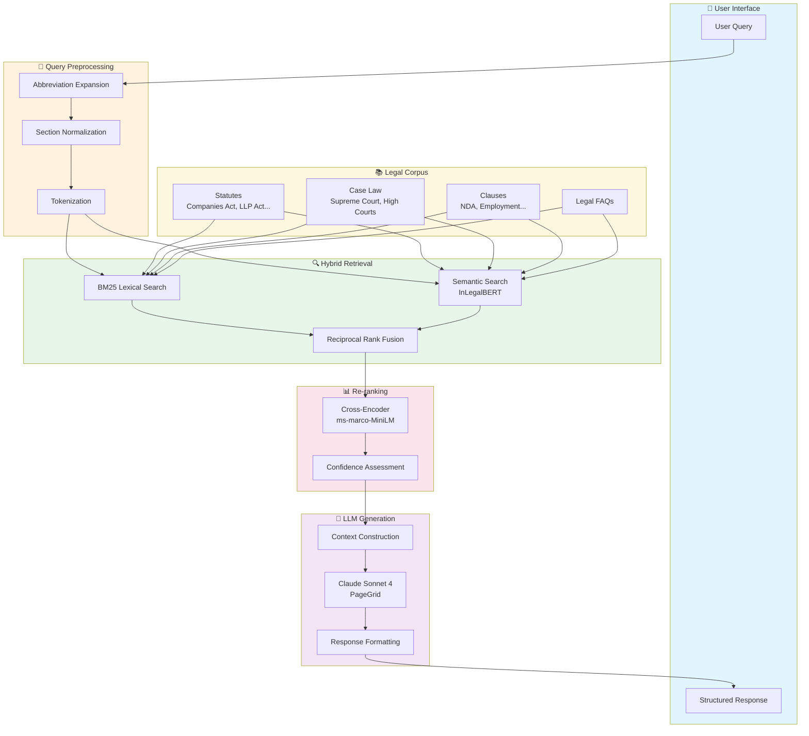

# JurisGPT RAG Architecture

## System Overview

```
┌─────────────────────────────────────────────────────────────────────────────────┐
│                              JURISGPT LEGAL AI PLATFORM                         │
│                     Citation-Grounded Legal Research Assistant                   │
└─────────────────────────────────────────────────────────────────────────────────┘

┌─────────────────┐     ┌─────────────────┐     ┌─────────────────┐
│   Next.js 16    │     │    FastAPI      │     │   Claude LLM    │
│   Frontend      │────▶│    Backend      │────▶│   (PageGrid)    │
│   React 19      │     │    Python       │     │   Sonnet 4      │
└─────────────────┘     └────────┬────────┘     └─────────────────┘
                                 │
                                 ▼
                    ┌────────────────────────┐
                    │     RAG PIPELINE       │
                    │   (rag_pipeline.py)    │
                    └────────────────────────┘
```

## Detailed RAG Pipeline Architecture

```
┌─────────────────────────────────────────────────────────────────────────────────┐
│                                USER QUERY                                        │
│                    "What are the requirements for LLP registration?"             │
└─────────────────────────────────────────────────────────────────────────────────┘
                                       │
                                       ▼
┌─────────────────────────────────────────────────────────────────────────────────┐
│                           QUERY PREPROCESSING                                    │
│  ┌─────────────────────────────────────────────────────────────────────────┐   │
│  │  • Legal Abbreviation Expansion (LLP → Limited Liability Partnership)    │   │
│  │  • Section Reference Normalization (sec 7 → Section 7)                   │   │
│  │  • Query Tokenization & Stopword Removal                                 │   │
│  └─────────────────────────────────────────────────────────────────────────┘   │
└─────────────────────────────────────────────────────────────────────────────────┘
                                       │
                                       ▼
┌─────────────────────────────────────────────────────────────────────────────────┐
│                          HYBRID RETRIEVAL SYSTEM                                 │
│                                                                                  │
│  ┌──────────────────────┐              ┌──────────────────────┐                │
│  │    BM25 Retrieval    │              │  Semantic Retrieval  │                │
│  │    (Lexical)         │              │  (InLegalBERT)       │                │
│  │                      │              │                      │                │
│  │  • Term Frequency    │              │  • 768-dim Vectors   │                │
│  │  • IDF Weighting     │              │  • Legal Domain      │                │
│  │  • Length Norm       │              │  • Cosine Similarity │                │
│  │                      │              │                      │                │
│  │  Weight: 0.4         │              │  Weight: 0.6         │                │
│  └──────────┬───────────┘              └──────────┬───────────┘                │
│             │                                      │                            │
│             └──────────────┬───────────────────────┘                            │
│                            ▼                                                    │
│             ┌──────────────────────────┐                                       │
│             │  Reciprocal Rank Fusion  │                                       │
│             │        (RRF)             │                                       │
│             │  Score = Σ 1/(k + rank)  │                                       │
│             └──────────────────────────┘                                       │
└─────────────────────────────────────────────────────────────────────────────────┘
                                       │
                                       ▼
┌─────────────────────────────────────────────────────────────────────────────────┐
│                          CROSS-ENCODER RE-RANKING                               │
│  ┌─────────────────────────────────────────────────────────────────────────┐   │
│  │  Model: ms-marco-MiniLM-L-6-v2                                           │   │
│  │  • Query-Document Pair Scoring                                           │   │
│  │  • Top-K Selection (k=5)                                                 │   │
│  │  • Relevance Score Normalization                                         │   │
│  └─────────────────────────────────────────────────────────────────────────┘   │
└─────────────────────────────────────────────────────────────────────────────────┘
                                       │
                                       ▼
┌─────────────────────────────────────────────────────────────────────────────────┐
│                          CONFIDENCE ASSESSMENT                                   │
│  ┌─────────────────────────────────────────────────────────────────────────┐   │
│  │  3-Criteria Scoring:                                                     │   │
│  │  1. Citation Count above threshold (0.65)                                │   │
│  │  2. Query-Topic Correspondence                                           │   │
│  │  3. Source Type Diversity (statute + case + clause)                      │   │
│  │                                                                          │   │
│  │  Confidence Levels: HIGH | MEDIUM | LOW | INSUFFICIENT                   │   │
│  └─────────────────────────────────────────────────────────────────────────┘   │
└─────────────────────────────────────────────────────────────────────────────────┘
                                       │
                                       ▼
┌─────────────────────────────────────────────────────────────────────────────────┐
│                         CONTEXT CONSTRUCTION                                     │
│  ┌─────────────────────────────────────────────────────────────────────────┐   │
│  │  [1] LLP Act Section 7 - Designated Partners (statute, 98%)              │   │
│  │  [2] LLP Act Section 5 - Partners (statute, 95%)                         │   │
│  │  [3] LLP Act Section 11 - Incorporation Document (statute, 92%)          │   │
│  │  [4] LLP Act Section 12 - Registration (statute, 89%)                    │   │
│  │  [5] Case: ABC vs Registrar of LLPs (case, 85%)                          │   │
│  └─────────────────────────────────────────────────────────────────────────┘   │
└─────────────────────────────────────────────────────────────────────────────────┘
                                       │
                                       ▼
┌─────────────────────────────────────────────────────────────────────────────────┐
│                      LLM GENERATION (Claude Sonnet 4)                           │
│  ┌─────────────────────────────────────────────────────────────────────────┐   │
│  │  Provider: PageGrid (api.pagegrid.in)                                    │   │
│  │  Model: claude-sonnet-4-6                                                │   │
│  │  Temperature: 0.3                                                        │   │
│  │  Max Tokens: 4000                                                        │   │
│  │                                                                          │   │
│  │  System Prompt:                                                          │   │
│  │  • Citation-grounded responses only                                      │   │
│  │  • Inline citations [1], [2], [3]                                        │   │
│  │  • No hallucination of legal facts                                       │   │
│  │  • Structured markdown output                                            │   │
│  └─────────────────────────────────────────────────────────────────────────┘   │
└─────────────────────────────────────────────────────────────────────────────────┘
                                       │
                                       ▼
┌─────────────────────────────────────────────────────────────────────────────────┐
│                           STRUCTURED RESPONSE                                    │
│  ┌─────────────────────────────────────────────────────────────────────────┐   │
│  │  {                                                                       │   │
│  │    "answer": "## LLP Registration Requirements\n\n...[1]...[2]",        │   │
│  │    "citations": [...],                                                   │   │
│  │    "confidence": "high",                                                 │   │
│  │    "grounded": true,                                                     │   │
│  │    "limitations": "Based on statute sources...",                         │   │
│  │    "follow_up_questions": [...]                                          │   │
│  │  }                                                                       │   │
│  └─────────────────────────────────────────────────────────────────────────┘   │
└─────────────────────────────────────────────────────────────────────────────────┘
```

## Data Flow Diagram

```
┌─────────────────────────────────────────────────────────────────────────────────┐
│                              LEGAL CORPUS                                        │
├─────────────────────────────────────────────────────────────────────────────────┤
│                                                                                  │
│  ┌─────────────────┐  ┌─────────────────┐  ┌─────────────────┐                 │
│  │    STATUTES     │  │   CASE LAW      │  │    CLAUSES      │                 │
│  ├─────────────────┤  ├─────────────────┤  ├─────────────────┤                 │
│  │ Companies Act   │  │ Supreme Court   │  │ NDA Clauses     │                 │
│  │ LLP Act         │  │ High Court      │  │ Founder Agmt    │                 │
│  │ IT Act          │  │ NCLT/NCLAT      │  │ Service Agmt    │                 │
│  │ IBC             │  │ Tribunals       │  │ Employment      │                 │
│  │ FEMA            │  │                 │  │                 │                 │
│  │ Competition Act │  │                 │  │                 │                 │
│  │ GST Act         │  │                 │  │                 │                 │
│  │ Income Tax Act  │  │                 │  │                 │                 │
│  └────────┬────────┘  └────────┬────────┘  └────────┬────────┘                 │
│           │                    │                    │                           │
│           └────────────────────┼────────────────────┘                           │
│                                ▼                                                │
│                    ┌───────────────────────┐                                   │
│                    │   47,756 Documents    │                                   │
│                    │   Tokenized + Indexed │                                   │
│                    └───────────────────────┘                                   │
└─────────────────────────────────────────────────────────────────────────────────┘
```

## Agentic Document Generation Flow

```
┌─────────────────────────────────────────────────────────────────────────────────┐
│                        AGENTIC DOCUMENT GENERATION                              │
└─────────────────────────────────────────────────────────────────────────────────┘
                                       │
                                       ▼
                    ┌──────────────────────────────┐
                    │     Intent Detection         │
                    │  "Draft an NDA agreement"    │
                    └──────────────────────────────┘
                                       │
                         ┌─────────────┴─────────────┐
                         ▼                           ▼
              ┌─────────────────────┐    ┌─────────────────────┐
              │  Simple/Template    │    │  Custom Document    │
              │  Request Detected   │    │  Request Detected   │
              └─────────────────────┘    └─────────────────────┘
                         │                           │
                         ▼                           ▼
              ┌─────────────────────┐    ┌─────────────────────┐
              │  Generate with      │    │  Ask for Missing    │
              │  Placeholders       │    │  Information        │
              └─────────────────────┘    └─────────────────────┘
                         │                           │
                         └─────────────┬─────────────┘
                                       ▼
                    ┌──────────────────────────────┐
                    │   Claude Document Generator  │
                    │   • Legal Formatting         │
                    │   • Indian Law Compliance    │
                    │   • Stamp Duty Info          │
                    │   • Clause Explanations      │
                    └──────────────────────────────┘
                                       │
                                       ▼
                    ┌──────────────────────────────┐
                    │   Complete Legal Document    │
                    │   + Key Clause Explanations  │
                    │   + Relevant Laws Referenced │
                    │   + Professional Disclaimer  │
                    └──────────────────────────────┘
```

## Component Stack

```
┌─────────────────────────────────────────────────────────────────────────────────┐
│                              TECHNOLOGY STACK                                    │
├─────────────────────────────────────────────────────────────────────────────────┤
│                                                                                  │
│  FRONTEND                    BACKEND                     AI/ML                  │
│  ─────────                   ────────                    ─────                  │
│  • Next.js 16                • FastAPI                   • Claude Sonnet 4      │
│  • React 19                  • Python 3.14               • PageGrid API         │
│  • TypeScript                • Pydantic                  • InLegalBERT (768d)   │
│  • TailwindCSS               • LangChain                 • BM25Okapi            │
│  • shadcn/ui                 • SSE Streaming             • Cross-Encoder        │
│                                                                                  │
│  DATA STORES                 INTEGRATIONS                INFRASTRUCTURE         │
│  ────────────                ────────────                ──────────────         │
│  • Local JSON Corpus         • DigitalOcean Spaces      • Docker Ready          │
│  • ChromaDB (optional)       • Supabase                 • Environment Config    │
│  • FAISS (optional)          • Obsidian Vault           • Hot Reload Dev        │
│  • BM25 Index                • Indian Kanoon API        • CORS Enabled          │
│                                                                                  │
└─────────────────────────────────────────────────────────────────────────────────┘
```

## Mermaid Diagram (for rendering)



---

## Key Metrics

| Metric | Value |
|--------|-------|
| Corpus Size | 47,756 documents |
| Embedding Dimensions | 768 (InLegalBERT) |
| Retrieval Top-K | 5 |
| Re-rank Candidates | 20 |
| BM25 Weight | 0.4 |
| Semantic Weight | 0.6 |
| Confidence Threshold | 0.65 |
| Max Response Tokens | 4,000 |

---

*Generated for JurisGPT v2.0 - Research-Level Citation-Grounded Legal AI*
